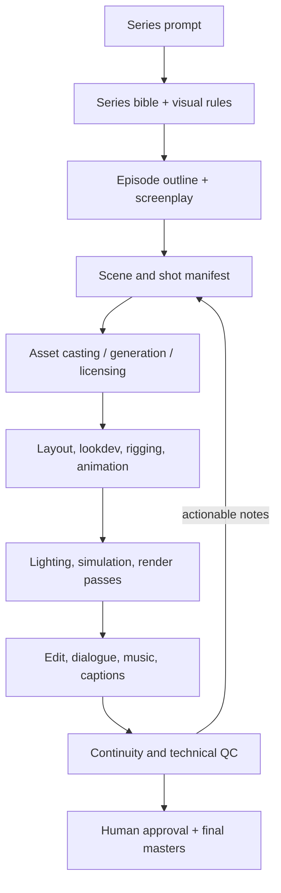

# Blend for me

**Blend for me** is a working name for a Blender extension and MCP server that
let AI agents inspect, build, rig, shade, animate, edit, and render Blender
projects through structured tools.

The project is already a broad Blender automation layer. It is not yet a
one-prompt television studio: it can execute production work reliably, but it
does not yet supply the story planner, persistent production state, asset and
voice generation, continuity supervision, simulation pipeline, or autonomous
review loop needed to turn an arbitrary prompt into a coherent finished episode.

## Verified status

Current snapshot, verified locally on August 8, 2026:

| Item | Current state |
| --- | --- |
| Blender | 5.2.0 LTS, Python 3.13.13 |
| MCP server | Python 3.11+, official `mcp` SDK 2.x |
| MCP tools | 231 tools across 16 modules |
| Blender bridge | 225 commands; 22 GUI-only; 169 undo-aware mutations |
| Unit and documentation tests | 60 passed |
| Real Blender headless checks | 107 passed, 6 correctly GUI-gated, 0 failed |
| Install artifact | `dist/blender_agent_mcp-0.1.0.zip`, validated by Blender |
| API compatibility probe | Passes all recorded Blender 5.2 assumptions |

The working package and extension identifiers remain `blender-agent-mcp` and
`blender_agent_mcp`. Renaming those identifiers is a separate compatibility and
migration decision; the **Blend for me** name can be used for the repository and
product without breaking existing installations.

## What is in the repository

| Path | Purpose |
| --- | --- |
| `blender_extension/` | Installable Blender extension. Hosts a loopback TCP bridge and runs Blender operations on the main thread. |
| `mcp_server/` | Stdio MCP server. Publishes agent-friendly tools and relays calls to Blender. |
| `skills/blender-agent-mcp/` | Agent operating guide, recipes, troubleshooting, and generated tool inventory. |
| `tests/` | Unit, protocol, documentation, parameter-validation, and real Blender smoke tests. |
| `scripts/` | Extension builder, installer, API compatibility probe, and inventory generator. |
| `docs/BLENDER_5X_API_NOTES.md` | Live-verified Blender 5.2 behavior and migration traps. |

## Architecture


Blender's Python API is not thread-safe. Socket threads only parse and queue
requests. A timer callback executes every Blender command on Blender's main
thread and returns structured JSON. Mutating bridge commands push an undo step
before execution.

The bridge binds to `127.0.0.1` only. It is not reachable from another machine.
The `execute_python` escape hatch can run arbitrary local Python, so dedicated
tools should be preferred and the bridge should be stopped when it is not in use.

## What agents can do now

### Scene and production settings

- Inspect scenes, objects, collections, selections, bounds, transforms, cameras,
  lights, materials, modifiers, armatures, and mesh statistics.
- Configure render engine/output, resolution, frame range, FPS, file formats,
  color management, units, world color, and world strength.
- Attach, inspect, animate, and remove custom properties on objects, data,
  materials, scenes, worlds, actions, node groups, rigs, cameras, lights, images,
  and collections.
- Save/open/append blend data and import/export OBJ, FBX, glTF, USD, STL, PLY,
  and Alembic.

### Modeling, sculpting, UVs, and weights

- Create and transform primitives, cameras, lights, empties, collections, and
  object hierarchies.
- Select and edit mesh geometry; extrude, inset, bevel, subdivide, bridge, fill,
  merge, symmetrize, recalculate normals, triangulate, smooth, and decimate.
- Add, configure, reorder, apply, and remove common modifiers.
- Use Blender 5.2's real sculpt brush assets, symmetry, dyntopo, voxel and
  Quadriflow remeshing, masks, face sets, and mesh filters.
- Create UV layers, seams, unwraps, smart projections, packing, and UV diagnostics.
- Build and repair vertex groups; auto-weight, normalize, mirror, smooth, clean,
  transfer, limit, diagnose, and visualize skin weights.

GUI-dependent brush and gesture tools deliberately refuse under headless Blender
instead of invoking operators known to crash a background process.

### Rigging and animation

- Create armatures and edit bones, parenting, constraints, IK, bone collections,
  custom shapes, drivers, shape keys, poses, and mesh bindings.
- Create and assign actions, key object or pose-bone properties, inspect Blender
  4.4+/5.x slotted-action F-Curves, change interpolation, and push actions to NLA.
- Animate many objects, bones, vector components, visibility switches, and custom
  properties in one call. Bulk tracks can clear only their own frame range and
  apply per-key interpolation/easing.
- Build named camera-cut plans from timeline markers. Blender switches bound
  cameras automatically as the playhead crosses each shot marker.

### Materials and textures

- Create and assign Principled materials, inspect node graphs, add/link/edit/remove
  individual nodes, load image textures correctly, and bake Cycles textures.
- Build or revise an entire procedural shader graph in one call. Nodes use
  caller-owned stable IDs, so retries update the intended nodes and links instead
  of producing `Noise Texture.001` duplicates.
- Author multi-stop Color Ramps, Frame organization, image-node assignments, and
  node defaults/properties.
- Create internal blank, UV-grid, color-grid, data, float, or custom-pixel images;
  list their color-space/packed state; and save verified external texture files.

### Editorial and final output

- Add/reuse image, movie, and audio strips in Blender's Video Sequencer.
- Extract movie audio into a paired strip, set channels/timing/volume/pan, and
  update compositing and 2D transforms.
- Generate retry-safe titles, captions, subtitles, lower thirds, backgrounds,
  slates, shadows, outlines, and caption boxes.
- Render a real camera-cut animation or the final Video Sequencer edit headlessly
  to H.264 MP4 or a numbered PNG sequence. Temporary render settings are restored,
  and output paths, file counts, frame counts, and bytes are verified.

## Quick start

Requirements: Blender 4.2 or newer (5.2 LTS is the verified target), macOS,
Python 3.11+, and [`uv`](https://docs.astral.sh/uv/).

Build the extension:

```bash
make build-ext
```

Install `dist/blender_agent_mcp-0.1.0.zip` through:

> Blender → Edit → Preferences → Get Extensions → menu → Install from Disk

In a 3D Viewport, open the sidebar with **N**, choose **Agent MCP**, and press
**Start Server**.

Register the MCP server with your client. For Claude Code:

```bash
claude mcp add blender-agent -- uv run --directory /ABSOLUTE/PATH/TO/REPO/mcp_server blender-agent-mcp
```

Then ask the agent to call `health` and `get_scene_info` before making changes.

## Example production request

> Inspect the current file. Create a 24 fps, 1920×1080 scene; make a neon-painted
> hallway material with a procedural noise and three-stop Color Ramp; animate the
> hero and door controls from frames 1–72; cut from `Camera_Wide` to
> `Camera_Close` at frame 49; add the supplied room tone and a centered subtitle;
> render a two-frame PNG proof first, then report every output path before the
> final MP4.

That request can now be decomposed into dedicated, observable, undoable tools
without falling back to one giant arbitrary Python script.

## Reliability and safety model

- Unknown tool parameters fail instead of being silently ignored. Handlers that
  delegate dynamic parameter dictionaries conservatively disable partial static
  allowlists rather than rejecting valid options.
- Shader graph calls use stable IDs and retry-safe link reuse.
- Existing images and media strips are not silently replaced with different
  dimensions, precision, type, or source files.
- Bulk animation, camera-cut builds, shader graphs, and sequencer mutations each
  become one Blender undo step.
- Explicit destructive selectors are required for marker/strip cleanup and blend
  file replacement.
- Slow calls have adjustable timeouts and final renders return verified artifacts,
  not unproven success messages.
- API assumptions are checked against the installed Blender with `make probe`.

## Prompt-to-show roadmap

The practical target is a supervised pipeline where one high-level prompt can
create a reviewable episode package, with approvals at creative and expensive
rendering boundaries.



### P0 — production reliability

1. Replace AST-inferred bridge parameter schemas with explicit shared schemas
   generated from the MCP tool definitions.
2. Add long-job IDs, progress events, cancellation, resumable render/bake queues,
   and robust handling when Blender closes during a job.
3. Add transactional rollback for partial multi-step failures, not only a manual
   undo checkpoint.
4. Add a clean-factory GUI acceptance suite for screenshots, sculpt strokes,
   weight gestures, viewport shading, and playblasts—the six paths that headless
   Blender correctly refuses.
5. Add crash recovery, automatic versioned `.blend` checkpoints, and a production
   artifact manifest with hashes and provenance.

### P1 — show, episode, scene, and shot state

1. Define versioned JSON schemas for a series bible, characters, locations,
   props, episodes, scenes, shots, continuity facts, and approval state.
2. Add tools to materialize and reconcile that manifest with Blender scenes,
   collections, linked libraries, actions, cameras, markers, and VSE strips.
3. Add asset dependency graphs, naming rules, reusable templates, linked asset
   overrides, and safe scene/shot cloning.
4. Add contact sheets, storyboards, animatics, shot status boards, and automatic
   low-resolution review renders before expensive work.

### P1 — cinematography, look development, and compositing

1. Add camera rigs, rails, handheld noise, lens/focus/DOF animation, framing rules,
   safe-area checks, and collision-aware camera paths.
2. Add batch light-rig creation, IES/HDRI management, light linking, exposure
   balancing, render layers, AOVs, Cryptomatte, and compositor node graphs with
   the same stable-ID graph model used by shaders.
3. Add one-call PBR texture-set wiring, UDIM management, projection/painting
   helpers, texture baking queues, and missing-file relinking.
4. Add color-managed review and delivery presets for web, broadcast, HDR, and
   archival image sequences.

### P1 — animation and character performance

1. Add complete F-Curve handle/tangent editing, channel grouping, retiming,
   key reduction, motion-path diagnostics, and richer NLA strip management.
2. Add animation clip libraries, pose libraries, root-motion controls, motion
   capture import/retargeting, and contact/foot-lock solvers.
3. Add phoneme/viseme tracks, audio-to-lip-sync, facial control standards,
   eye-line/blink/gaze generation, and emotion/performance passes.
4. Add crowd, background-action, procedural camera, and reusable acting-beat
   systems while keeping hero performances editable.

### P1 — editorial, sound, and delivery

1. Add VSE transitions/effects, speed and retiming controls, proxies, Meta strips,
   multicam switching, fades, crossfades, and nested sequence management.
2. Import/export SRT, WebVTT, EDL, FCPXML, and OpenTimelineIO; generate subtitles
   from dialogue timing and preserve revisions.
3. Add waveform analysis, loudness targets, fades, normalization, buses, room
   tone, dialogue/music/SFX stems, and final mix checks.
4. Add codecs, image-sequence formats, audio settings, burn-ins, slates, handles,
   review uploads, and resumable multi-deliverable renders.

### P2 — simulation and procedural production

1. Add cloth, hair/curves, rigid body, soft body, fluid, particle, and Geometry
   Nodes simulation controls with cache inspection, baking, invalidation, and
   deterministic seeds.
2. Add environment/set generators, scattering, vegetation, weather, destruction,
   and crowd layout with art-directable controls.
3. Add dependency-aware farm rendering and simulation workers rather than
   blocking one Blender process for an entire episode.

### P2 — creative orchestration

1. Add screenplay parsing and a planner that turns story beats into scenes, shots,
   characters, required assets, dialogue, camera intent, and duration budgets.
2. Add adapters for image, model, motion, speech, music, and sound-effect generation
   while recording model, prompt, license, source, and revision provenance.
3. Add persistent production memory that distinguishes approved canon from an
   agent's temporary proposal.
4. Add approval gates after script, storyboard, casting/lookdev, animatic,
   performance, lighting, and final edit. A one-prompt entry point should not mean
   silently spending hours rendering an unapproved interpretation.

### P2 — automated review and continuity

1. Detect missing textures, broken links, black/blank renders, invalid node links,
   unweighted vertices, bad frame ranges, clipping, unsafe captions, silent audio,
   and incomplete outputs.
2. Compare renders against approved references and previous shots for wardrobe,
   prop, lighting, screen direction, eye-line, scale, and color continuity.
3. Produce visual contact sheets and timestamped review notes that map directly
   back to shots, objects, controls, strips, and rerunnable tool calls.

## GitHub publication checklist

Before publishing a new repository:

- Choose the final repository URL, then replace the placeholder `website` and
  `maintainer` values in `blender_extension/blender_manifest.toml`.
- Add a root GPL-3.0-or-later `LICENSE` file; the manifest and package metadata
  already declare that license, but the repository does not yet contain its text.
- Review `.claude/memories/project_memory.json` before publishing. It is tracked
  project-assistant state and currently has local user changes unrelated to these
  implementation commits.
- Decide whether the public product/repository name is `blend-for-me` while
  retaining the stable internal package IDs, or whether a versioned migration of
  package IDs is worth the compatibility break.
- Replace example absolute paths and add screenshots or a short demo video.
- Run `make test`, `make probe`, `make skill-check`, and `make build-ext` from the
  release commit; attach the validated extension ZIP to the release.
- Tag the first public build (for example `v0.1.0`) and document which Blender
  versions were actually tested rather than promising every 4.2+ release equally.

## Current release commands

```bash
make test             # 60 unit/doc tests + real Blender headless suite
make probe            # live Blender API compatibility checks
make skill-check      # generated 231-tool inventory is current
make build-ext        # Blender-validated extension ZIP
```

The current foundation is already powerful enough for an agent to perform long,
structured Blender sessions and assemble a small animated sequence. The next
leap is not simply adding more low-level buttons: it is durable production state,
creative planning, generated asset provenance, resumable jobs, performance tools,
and automated review around the Blender controls that now exist.
