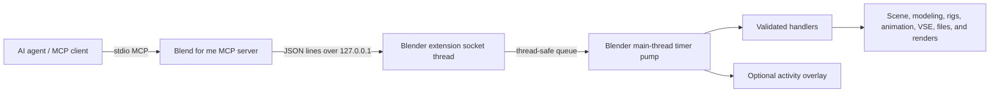

# Blend for me

AI-directed Blender production through a local extension and an MCP server.

**Blend for me** lets an AI agent inspect a Blender file, model and edit
geometry, build materials, sculpt, rig, weight-paint, animate, arrange camera
cuts, edit in the Video Sequencer, render, and verify the result with images.
It is designed to expose real Blender operations as structured tools instead of
forcing every task through one large Python script.

> **Naming:** Blend for me is the public product name. The existing internal
> identifiers remain `blender-agent-mcp` (Python package, executable, and Agent
> Skill) and `blender_agent_mcp` (Blender extension ID). Keeping those IDs stable
> avoids breaking installed extensions, MCP configurations, and tool references.

## Status

Blend for me is a capable **pre-release** project, not yet a finished public
1.0. The current implementation has broad Blender coverage and a substantial
test suite, but its protocol, failure-atomicity, GUI automation, packaging, and
GitHub publication work still need hardening.

Last locally verified on **August 9, 2026**:

| Area | Verified baseline |
| --- | --- |
| Blender | 5.2.0 LTS, Python 3.13.13 |
| MCP server | Python 3.11+, official `mcp` SDK 2.x |
| MCP catalog | 231 tools across 16 domains |
| Blender bridge | 226 commands, including 22 GUI-only commands |
| Unit and documentation tests | 64 passed |
| Headless Blender smoke checks | 110 passed, 6 correctly GUI-gated, 0 failed |
| API compatibility probe | Passed against the installed Blender 5.2 build |
| Packages | MCP wheel/sdist and Blender extension ZIP built successfully |

These numbers describe that local snapshot, not every future commit. Run the
verification commands in [Development and verification](#development-and-verification)
before relying on a checkout or publishing a release.

## What it can do


Heres an example of what could be done, this is a school hallway i prompted claude code or opus 5 extra high to model and composite and texture.

### Scene and object work

- Inspect scenes, objects, collections, transforms, bounds, selections,
  materials, modifiers, vertex groups, cameras, and lights.
- Create mesh primitives, empties, cameras, lights, and collection hierarchies.
- Transform, align, aim, frame, parent, join, separate, hide, and organize
  objects.
- Configure persistent render, output, color-management, unit, timeline, and
  World settings.
- Store pipeline metadata and rig controls as Blender custom properties.

### Modeling, sculpting, UVs, and weights

- Select and edit mesh geometry with BMesh-backed operations.
- Extrude, inset, bevel, subdivide, fill, bridge, merge, symmetrize, recalculate
  normals, triangulate, smooth, and decimate.
- Add, configure, reorder, apply, and remove common modifiers.
- Use Blender 5.2 sculpt brush assets, dyntopo, symmetry, voxel remesh,
  Quadriflow, masks, face sets, filters, and real GUI brush strokes.
- Create UV layers, mark seams, unwrap, smart-project, pack, and inspect UV
  statistics.
- Create and edit vertex groups, transfer and normalize weights, auto-weight a
  rig, diagnose unweighted geometry, and capture a weight heatmap.

### Materials, images, and procedural graphs

- Create Principled materials and assign them to objects or selected faces.
- Inspect and edit material node trees.
- Build retry-safe shader graphs using caller-owned stable node IDs.
- Build Color Ramps, frames, image texture nodes, links, and socket defaults.
- Create, list, save, load, and pack image datablocks.
- Bake common Cycles passes to internal images or external files.
- Construct Geometry Nodes groups and drive modifier inputs.

### Rigging, animation, and editorial

- Create armatures and bones, pose rigs, add constraints and IK, bind meshes,
  manage shape keys, drivers, and bone collections.
- Insert individual or bulk keyframes for objects, pose bones, vector
  components, visibility, and custom properties.
- Inspect Blender 4.4+/5.x slotted-action F-Curves, edit interpolation, assign
  actions, and push actions into the NLA.
- Build named camera-cut plans from timeline markers.
- Add image, movie, audio, text, and color strips to the Video Sequencer.
- Render camera-cut animation or a sequencer edit to MP4 or PNG frames.

### Agent understanding and verification

- Introspect the live Blender Python API with `describe_api`.
- Search version-correct Blender manual and Python API inventories.
- Return actionable Blender tracebacks instead of swallowing failures.
- Capture viewport screenshots and rendered frames for visual verification.
- Expose command metadata including GUI requirements and undo intent.
- Show an optional animated agent cursor and live terminal overlay in Blender.

## How it works

Blend for me has two runtime components:

| Component | Responsibility |
| --- | --- |
| `blender_extension/` | Runs inside Blender, listens on loopback TCP, queues commands, and executes `bpy` work on Blender's main thread. |
| `mcp_server/` | Runs as a stdio MCP server, exposes agent-friendly tools, and relays calls to the Blender extension. |



Blender's Python API is not thread-safe. Socket threads only parse requests and
enqueue work. A `bpy.app.timers` callback drains that queue and executes every
handler on Blender's main thread.

The bridge binds to `127.0.0.1` by default. It is not intended to be exposed to
another machine.

## Requirements and compatibility

- macOS 13 or newer is the current development environment.
- Blender 5.2 LTS is the verified target.
- The extension manifest currently declares Blender 4.2 as its minimum, but a
  complete 4.2-through-5.2 compatibility matrix has **not** been run. Treat 5.2
  as the supported public baseline until older versions are tested.
- Python 3.11 or newer for the MCP server.
- [`uv`](https://docs.astral.sh/uv/) for dependency and environment management.
- Blender is currently expected at
  `/Applications/Blender.app/Contents/MacOS/Blender` unless `BLENDER` or an
  explicit script argument supplies another path.

Linux and Windows support are not yet release-verified. Most MCP-side code is
portable, but the current build defaults, Metal setup, and the `run_terminal`
string-command path are macOS-oriented.

## Quick start

### 1. Get the repository and verify dependencies

```bash
git clone <FINAL_REPOSITORY_URL>
cd <REPOSITORY_DIRECTORY>
uv sync --directory mcp_server --extra dev
```

The final public repository URL has not been chosen yet; do not publish the
placeholder above as a real install command.

### 2. Build the Blender extension

```bash
make build-ext
```

The artifact is written to:

```text
dist/blender_agent_mcp-<version>.zip
```

When Blender is available, the builder uses Blender's extension build command
and validates the archive layout.

### 3. Install the extension in Blender

Use Blender's UI for the reliable current path:

1. Open **Blender → Edit → Preferences → Get Extensions**.
2. Open the menu in the top-right corner.
3. Choose **Install from Disk…**.
4. Select `dist/blender_agent_mcp-<version>.zip`.
5. Approve the requested network and file permissions.
6. Make sure **Blend for me** is enabled.

The scripted `make install-ext` target is still being hardened and should not be
treated as the public installation path yet.

### 4. Start the Blender bridge

In a 3D Viewport:

1. Press **N** to open the sidebar.
2. Open the **Agent MCP** tab.
3. Press **Start Server**.

The default port is `9876`. A different port can be selected in the panel or
set with `BLENDER_AGENT_PORT`. Blender and the MCP server must use the same
port.

### 5. Register the MCP server

Any MCP client that can launch a stdio server can run:

```bash
uv run --directory "/ABSOLUTE/PATH/TO/REPOSITORY/mcp_server" blender-agent-mcp
```

A generic MCP configuration looks like:

```json
{
  "mcpServers": {
    "blend-for-me": {
      "command": "uv",
      "args": [
        "run",
        "--directory",
        "/ABSOLUTE/PATH/TO/REPOSITORY/mcp_server",
        "blender-agent-mcp"
      ]
    }
  }
}
```

Use absolute paths because desktop clients may launch the server from an
unpredictable working directory.

For Claude Code, the equivalent registration is:

```bash
claude mcp add blend-for-me -- uv run --directory "/ABSOLUTE/PATH/TO/REPOSITORY/mcp_server" blender-agent-mcp
```

Client configuration formats change independently of this project. Verify a
client's current official documentation before publishing more client-specific
examples.

### 6. Check the connection

Ask the agent to call `health`, then `get_scene_info`.

A useful first request is:

> Inspect the current scene. Tell me which object and camera are active, then
> create a UV sphere, voxel-remesh it at 0.03, and take a viewport screenshot.

## Recommended agent workflow

Reliable Blender automation should be iterative:

1. **Connect:** call `health` and inspect bridge capabilities.
2. **Observe:** call `get_scene_info` and inspect the exact objects involved.
3. **Plan:** choose dedicated tools and identify destructive or expensive work.
4. **Checkpoint:** create an undo checkpoint before topology, rig, or file
   operations.
5. **Act:** make small, structured changes with exact object names.
6. **Verify:** re-read state and capture a screenshot, heatmap, or render.
7. **Save deliberately:** report the destination before writing or overwriting
   an external file.

Prefer dedicated tools over `execute_python`. The escape hatch is valuable for
novel Blender work, but dedicated tools provide better validation, structured
results, and documentation.

## Tool domains

The generated catalog is the source of truth for exact names and parameters.

| Domain | Main capabilities |
| --- | --- |
| `core` | Health, versions, scene inspection, modes, undo/redo, Python execution, live API inspection, screenshots, still renders |
| `objects` | Primitives, empties, cameras, lights, transforms, parenting, collections, visibility, selection, alignment |
| `mesh` | Mesh selection and topology operations, normals, smoothing, triangulation, decimation |
| `modifiers` | Generic and specialized modifier creation, settings, order, application, and removal |
| `sculpt` | Brush assets, strokes, symmetry, dyntopo, remeshing, masks, face sets, filters |
| `weights` | Vertex groups, automatic and manual weights, transfer, cleanup, diagnostics, heatmap |
| `rig` | Armatures, bones, poses, constraints, IK, binding, shape keys, drivers, bone collections |
| `shading` | Materials, shader graphs, images, textures, viewport shading, baking |
| `uv` | UV layers, seams, unwrap, smart project, packing, diagnostics |
| `anim` | Timeline, keyframes, interpolation, actions, NLA, playblast |
| `cinematics` | Camera cuts, markers, Video Sequencer strips, final animation rendering |
| `geonodes` | Geometry Nodes groups, sockets, nodes, links, modifiers, inputs |
| `settings` | Render/output settings, color management, units, World background |
| `properties` | Persistent custom Blender ID properties and UI metadata |
| `io` | Model import/export and blend save/open/list/append operations |
| `docs` | Blender manual/API search, page extraction, tutorials, local cache |

To inspect the current installed bridge rather than assuming it matches this
checkout, call `list_bridge_commands`.

## What requires GUI Blender

Commands that need an actual `VIEW_3D` area refuse safely under
`blender --background`. They include:

- viewport screenshots and viewport shading changes;
- playblasts;
- sculpt brush strokes and gestures;
- weight gradients and weight heatmaps;
- mask and face-set gestures.

Most data-API operations—objects, mesh data, modifiers, rigging, materials, UVs,
animation, settings, properties, and import/export—also run in headless Blender.

`list_bridge_commands` reports `needs_gui` for each command.

## Visible agent activity

In GUI Blender, Blend for me can show what the agent is doing:

- a GPU-rendered cursor appears over the editor related to the command;
- shader graph builds can move the cursor between real node mutations;
- `execute_python` can display a small live Agent Terminal overlay;
- `agent_activity.step(label, [x, y])` exposes progress from custom graph code;
- `run_terminal(command, cwd=None, timeout=120, check=True)` streams an external
  command's output into the overlay;
- the N-panel contains visibility, cursor, terminal, scale, timing, and preview
  controls.

The overlay is optional, disabled safely in headless mode, and isolated so a UI
failure does not prevent the Blender command from running.

The current string form of `run_terminal` uses zsh. An argv list avoids shell
interpretation and is the preferred form:

```python
execute_python(
    code="run_terminal(['python3', '-u', 'render_preview.py'], cwd='/path/to/show')",
    timeout=180,
)
```

## Agent Skill

The repository includes an Agent Skill at:

```text
skills/blender-agent-mcp/
```

It teaches session startup, the observe–act–verify loop, tool selection,
sculpting, weight painting, rigging, animation, recipes, and troubleshooting.
The skill retains its internal name so existing installations continue to work.

Project-local installation:

```bash
mkdir -p .claude/skills
ln -s ../../skills/blender-agent-mcp .claude/skills/blender-agent-mcp
```

Personal installation:

```bash
mkdir -p ~/.claude/skills
cp -R skills/blender-agent-mcp ~/.claude/skills/
```

After changing MCP tools, regenerate and verify the catalog:

```bash
make skill-inventory
make skill-check
```

The documentation tests compare tool names, parameters, required fields, GUI
flags, and skill references against the live MCP catalog.

## Repository layout

| Path | Purpose |
| --- | --- |
| `blender_extension/` | Installable Blender extension, bridge, registry, activity overlay, and Blender handlers |
| `mcp_server/` | Python stdio MCP server and agent-facing tool wrappers |
| `skills/blender-agent-mcp/` | Agent operating guide, recipes, generated catalog, and deep references |
| `tests/` | Unit tests, protocol tests, documentation checks, headless Blender smoke suite, and GUI demo harness |
| `scripts/` | Extension builder, installer, Blender API probe, and support scripts |
| `docs/BLENDER_5X_API_NOTES.md` | Live-verified Blender 5.x API behavior and migration traps |
| `Blend for me.md` | Product brief, verified implementation map, production roadmap, and publication checklist |

## Development and verification

Set a custom Blender executable when necessary:

```bash
make BLENDER="/path/to/blender" probe
```

Core commands:

```bash
make test-unit      # Python unit and documentation tests
make smoke          # real Blender headless smoke checks
make test           # unit tests followed by headless Blender smoke checks
make probe          # verify recorded Blender/MCP API assumptions
make skill-check    # fail when the generated Agent Skill inventory is stale
make build-ext      # build and validate the Blender extension ZIP
make run-server     # run the MCP server over stdio
```

Run the activity UI in a disposable Blender window directly:

```bash
"/Applications/Blender.app/Contents/MacOS/Blender" \
  --factory-startup --python tests/gui_activity_demo.py
```

The current `make demo` target still references an obsolete filename, and the
current `make install-ext` path needs an argument-handling fix. They should be
repaired before being used as release gates.

After upgrading Blender, run `make probe` before changing compatibility claims.
The probe exists because multiple Blender 5.x APIs differ from older examples,
including sculpt brush assets, slotted actions, Geometry Nodes modifier inputs,
Video Sequencer collections, and import/export operator names.

## Known pre-release limitations

- Only Blender 5.2 has been exercised as the complete local target.
- The loopback bridge currently has no pairing token or authentication.
- The bridge has an initial protocol-version handshake, but the client still
  permits a legacy fallback when it times out or is unavailable. Peer identity,
  strict version enforcement, and authenticated pairing are not complete.
- A connection failure after sending a command can make a mutating retry
  ambiguous; do not blindly retry destructive work after a timeout.
- An undo step is not the same as automatic transactional rollback. Some
  multi-stage Blender operations still need stronger failure atomicity.
- Some image-returning MCP tools currently drop useful non-image diagnostics.
- The convenience Cycles selection path needs clean-factory hardening; verify the
  scene engine and a small proof render before starting an expensive job.
- Headless tests verify GUI-only commands refuse safely, but full automated GUI
  behavior coverage is not complete.
- Dedicated texture-paint, compositor graph, World graph, simulation, richer
  F-Curve/NLA, and advanced VSE workflows are still roadmap items.
- Long Blender operations are synchronous and do not yet have durable job IDs,
  progress, cancellation, or reconnectable status.

See [`Blend for me.md`](Blend%20for%20me.md) for the larger implementation and
production roadmap.

## Troubleshooting

### The MCP server cannot reach Blender

Confirm that:

1. Blender is running normally, not only as a background process.
2. **Blend for me** is enabled.
3. The N-panel shows that the bridge is started.
4. Blender and the MCP server use the same port.
5. The MCP client uses an absolute path to `mcp_server/`.

Then call `reconnect` and `health`.

### Port 9876 is already in use

Another process or Blender MCP extension may already own the default port.

```bash
lsof -nP -iTCP:9876 -sTCP:LISTEN
```

Stop the other listener or choose a different port in the Blender panel and set
the same `BLENDER_AGENT_PORT` for the MCP server.

Because the current protocol has no identity handshake, connecting to a
different service on the same port may look like a timeout rather than an
immediate wrong-server error.

### A tool exists in the MCP server but Blender says “unknown command”

The installed Blender extension is a built ZIP, not a live import of this source
checkout. Rebuild the extension, reinstall the new ZIP, and restart the bridge.
Save the current Blender file first.

Use `list_bridge_commands` before a session that depends on newly added tools.

### A tool says it needs a 3D Viewport

Run Blender with its GUI and keep a `VIEW_3D` area open. Data-API alternatives
can still work headlessly.

### A command times out

Rendering, remeshing, baking, Quadriflow, and playblasts can take much longer
than the default command budget. Use the tool's `timeout` parameter when it has
one. Do not immediately repeat a mutating command after an ambiguous timeout;
inspect the scene first.

If every command times out, Blender's main thread may be held by a modal
operator, render, or open dialog.

### The MCP process fails before connecting

Run its command directly to expose dependency or path errors:

```bash
uv run --directory "/ABSOLUTE/PATH/TO/REPOSITORY/mcp_server" blender-agent-mcp
```

## Security and safety

- The bridge listens on loopback by default, but it currently has no
  authentication. Any local process running as the same user can attempt to
  drive it. Stop the bridge when it is not needed.
- Never expose port 9876 to a LAN or the public internet.
- `execute_python` runs arbitrary Python inside Blender with the user's
  privileges.
- `run_terminal` can launch local processes and shell commands.
- Import, export, render, bake, image save, and blend-file tools can write files.
- Opening another blend can discard unsaved changes and therefore requires
  explicit confirmation.
- Prefer dedicated tools, exact object names, small changes, checkpoints, and
  verification renders.
- Back up important `.blend` files before testing pre-release automation.

## GitHub publication checklist

Before making the repository public:

- choose the final repository URL and maintainer identity;
- replace placeholder metadata in `blender_extension/blender_manifest.toml` and
  the documentation;
- add the complete root GPL-3.0-or-later `LICENSE` file;
- remove local `.claude` memory/settings from public tracking and address their
  presence in Git history;
- verify the provenance and redistribution rights of every SVG, image, and
  `.blend` fixture;
- add CI, contribution, code-of-conduct, security, support, and changelog files;
- repair and test scripted installation and GUI demo targets;
- decide whether the first public compatibility baseline is Blender 5.2 or run
  the promised older-version matrix;
- run the full verification suite from the release commit;
- build and validate the extension ZIP, wheel, and sdist;
- attach checksums and publish only reviewed artifacts.

## License

The extension manifest and Python package metadata declare
**GPL-3.0-or-later**, matching Blender Python API requirements. A complete root
`LICENSE` file still needs to be added before public release.
